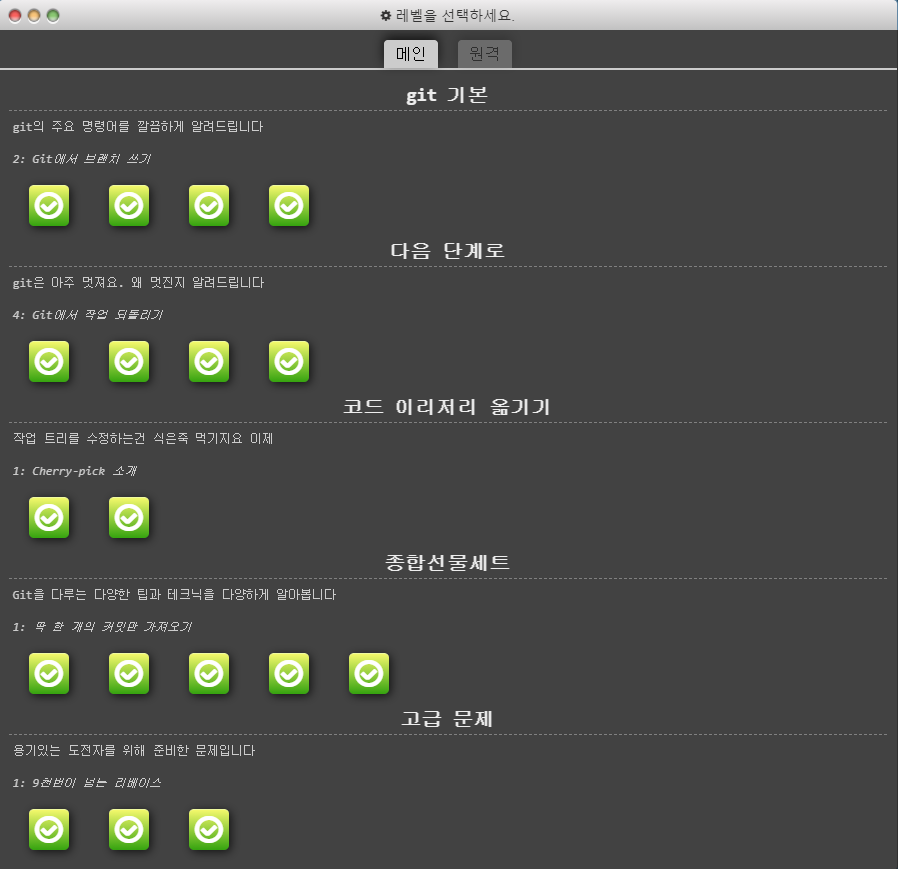
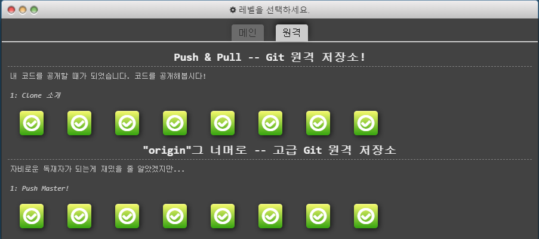
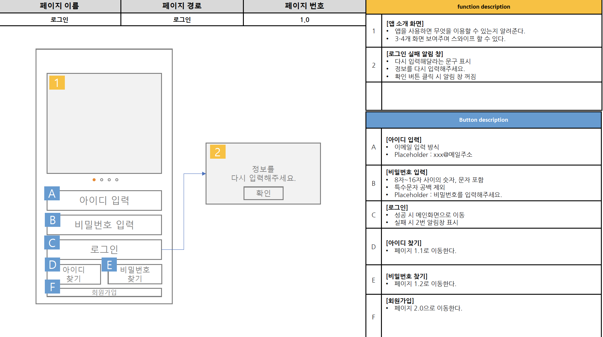
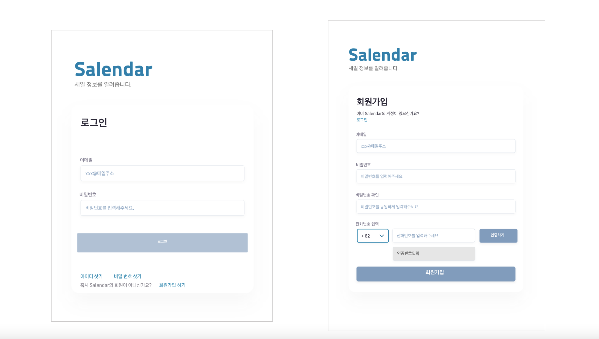

# Git을 연습하자!💬
## 0107_Git 실습
### git 기본
* git에서 브랜치 쓰기
* git에서 작업 되돌리기

### 코드 옮기기
* cherry-pick 실습
* 다양한 테크닉

### 고급문제
* 9번이상의 리베이스

### git 저장소
* push & pull & merge & fetch

## 0108_UI 실습
### Tool

### Preview
#### 와이어프레임

#### 유저 편의성 고려

